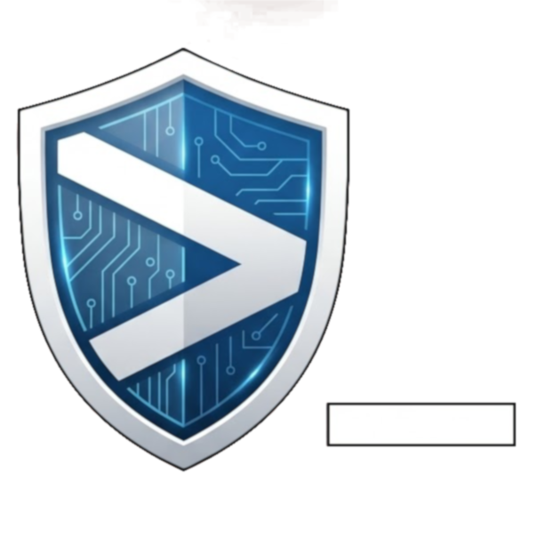

<div align="center">
  
  <br/>
  
</div>

# CoSSH (Cobalt SSH)

[](https://github.com/adamoutler/cossh/actions/workflows/ci.yml)
[](https://sonarcloud.io/summary/new_code?id=adamoutler_cossh)
[](https://sonarcloud.io/summary/new_code?id=adamoutler_cossh)
[](https://sonarcloud.io/summary/new_code?id=adamoutler_cossh)
[](https://sonarcloud.io/summary/new_code?id=adamoutler_cossh)
[](https://sonarcloud.io/summary/new_code?id=adamoutler_cossh)
[](https://sonarcloud.io/summary/new_code?id=adamoutler_cossh)
[](https://sonarcloud.io/summary/new_code?id=adamoutler_cossh)
[](https://sonarcloud.io/summary/new_code?id=adamoutler_cossh)
[](https://sonarcloud.io/summary/new_code?id=adamoutler_cossh)
[](https://sonarcloud.io/summary/new_code?id=adamoutler_cossh)
[](https://sonarcloud.io/summary/new_code?id=adamoutler_cossh)

CoSSH is a native, highly secure Android SSH terminal client designed to replace legacy applications. It features a cobalt-blue aesthetic, one-touch connectivity, robust hardware-backed local Keystore encryption, and Google Drive cloud sync.

## 🚀 Features

*   **Native & Modern:** Built entirely with Kotlin and Jetpack Compose for a fluid, responsive Android experience.
*   **Uncompromising Security:** 
    *   Zero-cleartext volatile state sanitization.
    *   Hardware-backed Android Keystore encryption for saved profiles and identities.
    *   High-friction Host Key MITM warnings (Trust On First Use).
    *   Strict OS-level backup exclusions to protect private keys.
*   **Robust Terminal:** Full PTY emulation with 256-color support, customizable extra keys (Ctrl, Alt, Esc, Tab, F1-F12), and secure background connection persistence.
*   **Advanced Capabilities:**
    *   RSA and ED25519 Key Generation and PEM parsing.
    *   Port Forwarding (Local & Remote).
    *   Legacy Telnet protocol support (with explicit insecurity warnings).
*   **Cloud Sync (Premium):** Securely synchronize your encrypted profiles via Google Drive.

## 🛠️ Tech Stack

*   **Language:** Kotlin
*   **UI Framework:** Jetpack Compose (Material Design 3)
*   **Networking:** [sshj](https://github.com/hierynomus/sshj), Apache Commons Net (Telnet)
*   **Cryptography:** BouncyCastle, Android Security Crypto (EncryptedSharedPreferences)
*   **Terminal Emulation:** Termux JNI / Terminal-View

## 🏗️ Getting Started

### Prerequisites
*   Android Studio
*   JDK 17+

### Build Instructions
To build the application locally:
```bash
# Clone the repository
git clone https://github.com/adamoutler/cossh.git
cd cossh

# Run local tests and linting
./gradlew test lint

# Build the debug APK
./gradlew assembleDebug
```

## 🧪 Testing and QA
CoSSH adheres to strict "Zero-Tolerance Quality" standards.
- Minimum 80% Unit Test coverage is strictly enforced via CI.
- All UI components are verified via Robolectric/Paparazzi snapshot tests.
- Commits are automatically analyzed by SonarCloud for bugs and vulnerabilities.

## 🔒 Security Policy
Security is the paramount invariant of this project. If you discover a vulnerability, please report it immediately. The app intentionally refuses to fall back to insecure storage mechanisms.