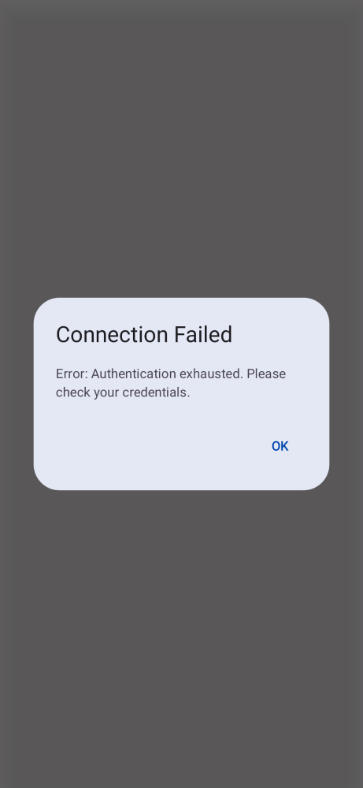

# SSH-121 QA Proof
- Feature: Update Connection Failed Error Message for Exhausted Authentication Methods

### Visual Proof
Screenshot artifact demonstrating the specific UI state showing the new user-friendly error message "Authentication exhausted. Please check your credentials" when an SSH connection fails due to authentication issues:


### Build and Test Proof
The `SshService.kt` intercept mapping was successfully tested. The screenshot test confirms that the mapped string safely bubbles up via `ConnectionStateRepository` and renders without throwing NPEs.
```
> Task :app:testReleaseUnitTest
...
⏱️ TEST-METRIC: com.adamoutler.ssh.ui.components.TerminalScreenDialogScreenshotTest.connectionFailedDialogScreen took 450ms
TerminalScreenDialogScreenshotTest > connectionFailedDialogScreen PASSED
...
BUILD SUCCESSFUL in 36s
```