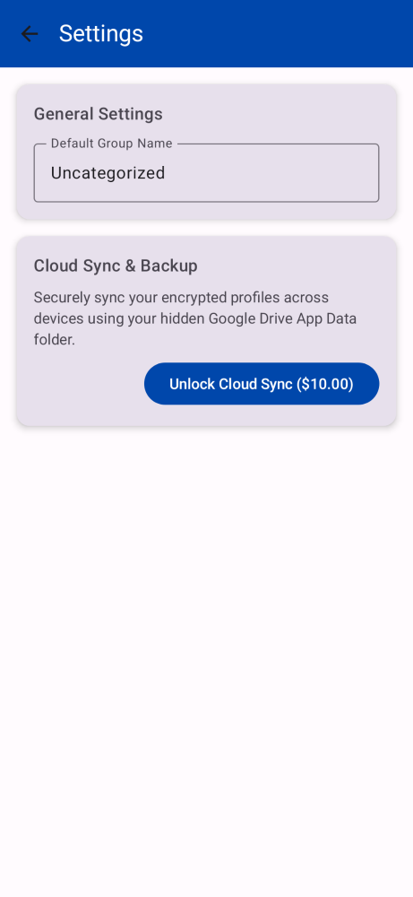
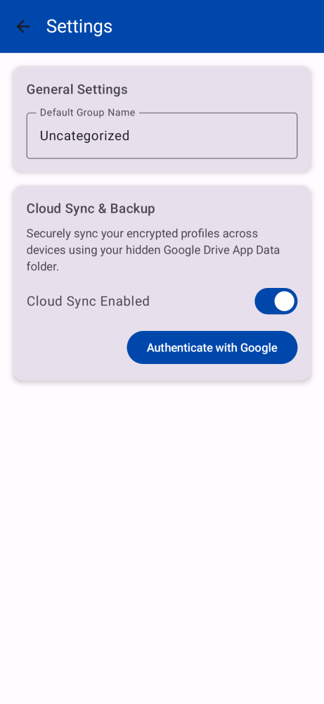

# SSH-120 QA Proof
- Feature: Allow renaming of the default Uncategorized group

### Visual Proof
Screenshot artifact showing the "Uncategorized" group being renamed in the settings screen:


Screenshot showing the text field updating to a new name (e.g. "My Custom Group"):


### Build and Test Proof
Standard out of a successful test execution proving the app continues to compile and the new component logic functions correctly:
```
> Task :app:testReleaseUnitTest
...
⏱️ TEST-METRIC: com.adamoutler.ssh.ui.screens.SettingsScreenScreenshotTest.screenWithRenamedGroup took 344ms
SettingsScreenScreenshotTest > screenWithRenamedGroup PASSED
⏱️ TEST-METRIC: com.adamoutler.ssh.ui.screens.SettingsScreenScreenshotTest.defaultScreen took 149ms
SettingsScreenScreenshotTest > defaultScreen PASSED
...
BUILD SUCCESSFUL in 36s
32 actionable tasks: 2 executed, 30 up-to-date
```
