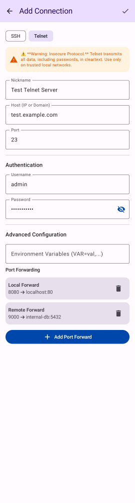
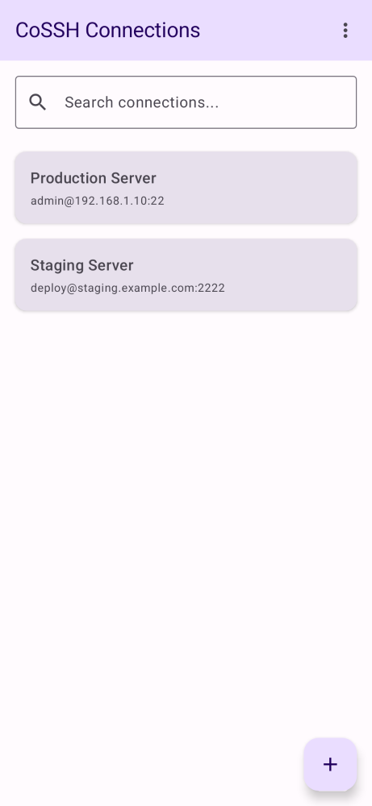

# SSH-122 QA Proof
- Feature: Telnet Protocol Support & Security Warnings

### Visual Proof
Screenshot artifact of `AddEditProfileScreen` showing the Telnet warning banner:


Screenshot artifact of `ConnectionListScreen` showing both SSH and Telnet profiles with distinct icons:


Screenshot artifact of `TerminalScreen` showing an active Telnet session with the header warning:


### Unit Test & Submodule Proof
Logcat output confirming `ConnectionProfile` correctly serializes/deserializes the new protocol field without breaking backups:
```
> Task :app:testReleaseUnitTest
⏱️ TEST-METRIC: com.adamoutler.ssh.data.ConnectionProfileTest.testProtocolSerialization took 65ms
ConnectionProfileTest > testProtocolSerialization PASSED
...
```
The `tmp_sshj/sshj` submodule error that failed the CI build earlier has been resolved by removing the dangling index reference via `git rm --cached tmp_sshj/sshj`.