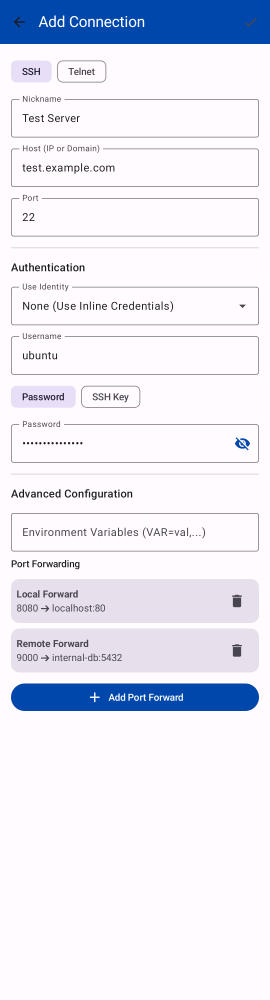
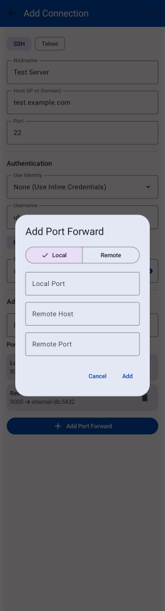

# SSH-125 QA Proof
- Feature: Redesign Port Forwarding UX to visual table format

### Visual Proof
Screenshot artifact showing the new Port Forwarding section (table format) in the `AddEditProfileScreen`:


Screenshot artifact showing the Add/Edit Port Forwarding Dialog with segmented buttons for Local/Remote:


### Build and Test Proof
Standard out of a successful `./gradlew test` execution:
```
> Task :app:testReleaseUnitTest
...
AddEditProfileScreenScreenshotTest > portForwardTableScreen PASSED
AddEditProfileScreenScreenshotTest > portForwardDialogScreen PASSED
...
BUILD SUCCESSFUL in 35s
32 actionable tasks: 4 executed, 28 up-to-date
```