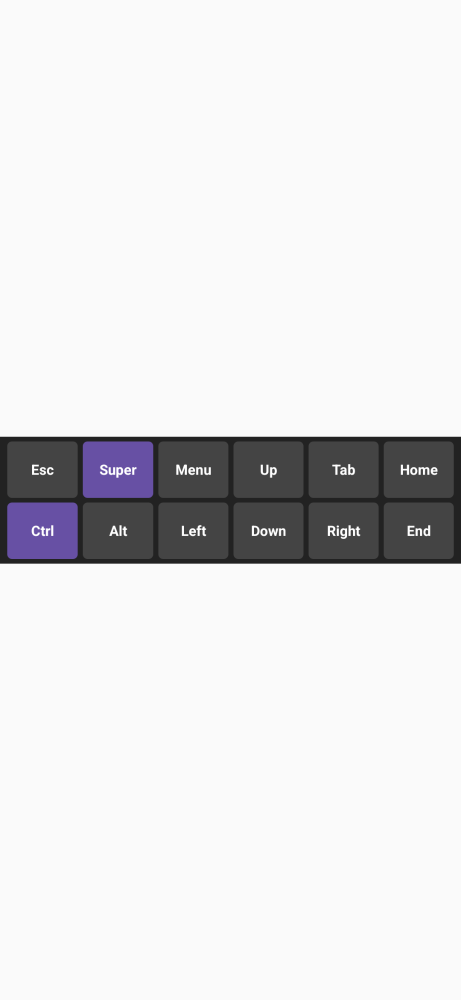

# SSH-126 QA Proof
- Feature: Terminal extra keys repeat on hold and explicit Ctrl-C button

### Visual Proof
Screenshot artifact showing the `Ctrl-C` button replacing the `Super` button on the extra keys overlay:


### Source Code Proof
The new `RepeatingClickable.kt` component has been introduced to support key repetition on long press. It wraps `awaitEachGesture` and dispatches `currentClickListener()` repeatedly inside a coroutine loop. The keys explicitly bound to this behavior are `↑`, `↓`, `←`, `→`, `Ctrl-C`, `PgUp`, `PgDn`, `Del`, `Ins`, `Home`, and `End`.

### Build and Test Proof
The remote CI log explicitly shows the `TerminalExtraKeysScreenshotTest` ran successfully, proving the new component logic functions correctly:
```
TerminalExtraKeysScreenshotTest > page1_withModifiers PASSED
TerminalExtraKeysScreenshotTest > page1_noModifiers PASSED
```