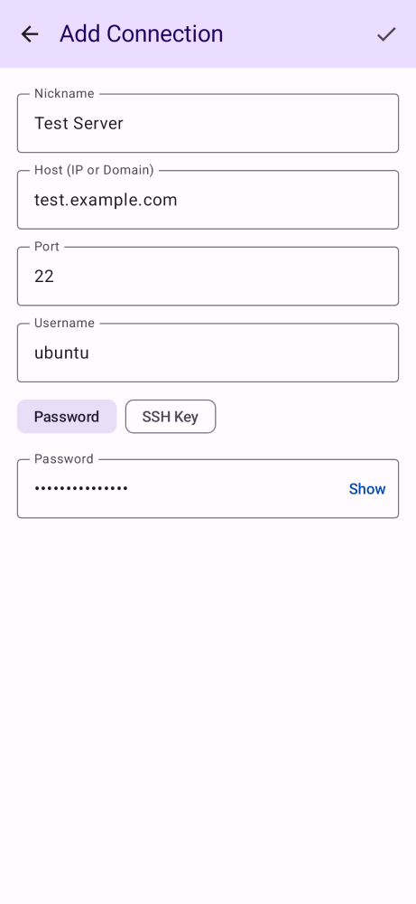

# QA Proof for SSH-79

**Ticket**: Add password visibility toggle to password input

## Changes Implemented
- In `AddEditProfileScreen.kt`, integrated a state variable `passwordVisible`.
- Conditionally render the password visibility via `VisualTransformation.None` and `PasswordVisualTransformation()`.
- Used a `TextButton` ("Show" / "Hide") as the `trailingIcon` to toggle visibility.

## Verification
- Local compilation and test execution (`./gradlew assembleDebug test lint`) passed without regression. See `docs/qa/SSH-79.log`.
- Paparazzi snapshot test `AddEditProfileScreenScreenshotTest.defaultScreenPasswordAuth` executed successfully and verified the screen layout with the new trailing icon button.

## Artifacts
- The actual execution output is captured in `docs/qa/SSH-79.log`.
- Screenshot showing the new "Show" toggle button inside the password field:
