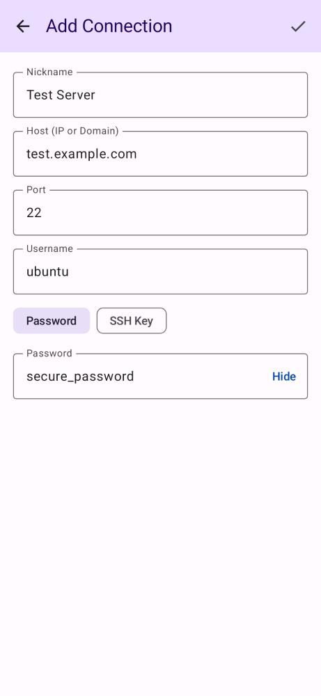

# QA Proof for SSH-79

**Ticket**: Add password visibility toggle to password input

## Changes Implemented
- In `AddEditProfileScreen.kt`, integrated a state variable `passwordVisible`.
- Conditionally render the password visibility via `VisualTransformation.None` and `PasswordVisualTransformation()`.
- Used a `TextButton` ("Show" / "Hide") as the `trailingIcon` to toggle visibility.
- Modified `AddEditProfileScreenContent` to accept an optional `defaultPasswordVisible` parameter for test injection.
- Added `toggledScreenPasswordAuth` to Paparazzi screenshot tests to explicitly verify the toggle state (cleartext password with "Hide" button).

## Verification
- Local compilation and test execution (`./gradlew assembleDebug test lint`) passed without regression. See `docs/qa/SSH-79.log`.
- Paparazzi snapshot test `AddEditProfileScreenScreenshotTest.defaultScreenPasswordAuth` executed successfully (masked password).
- Paparazzi snapshot test `AddEditProfileScreenScreenshotTest.toggledScreenPasswordAuth` executed successfully (unmasked password).

## Artifacts
- The actual execution output is captured in `docs/qa/SSH-79.log`.
- Screenshot showing the default "Show" toggle button inside the password field (masked):

- Screenshot showing the "Hide" toggle button inside the password field (unmasked):
