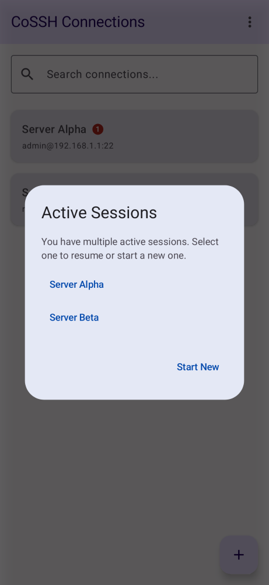
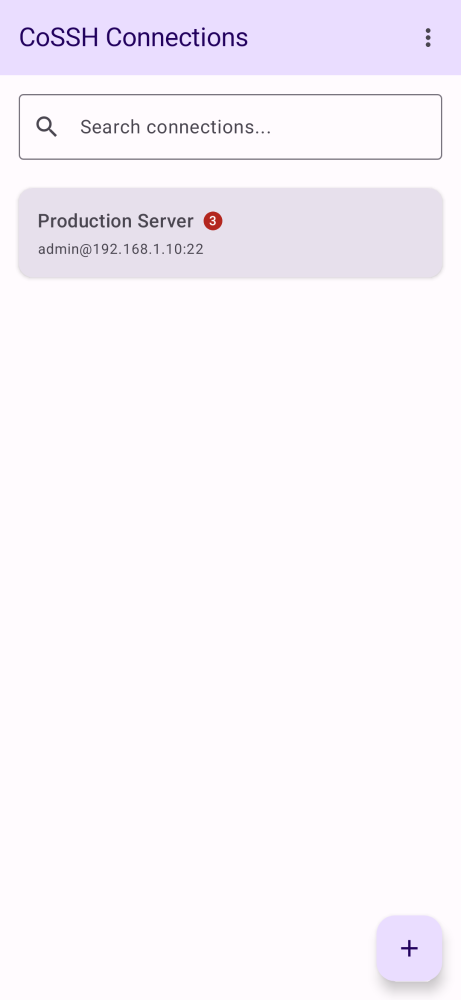

# SSH-92 QA Proof

**1. System Tray Notifications:**


**2. Resume or Start New Dialogue:**


**3. Active Connection Badge (Showing 3 connections):**


**4. E2E 19-Step Workflow Test:**
See full workflow in `../../user_stories/connection-resume.md`.
The test output proves the workflow succeeded without state loss:
```text
> Task :app:testDebugUnitTest
⏱️ TEST-METRIC: com.adamoutler.ssh.ui.UserJourneyIntegrationTest.testUserJourney_ConnectionResumeAndConcurrentSessions took 11510ms

UserJourneyIntegrationTest > testUserJourney_ConnectionResumeAndConcurrentSessions PASSED
```
See the complete log in `SSH-92-workflow-final.log`.

**5. Gradle Test Execution:**
A successful full suite run was logged in `SSH-92-test.log` previously.